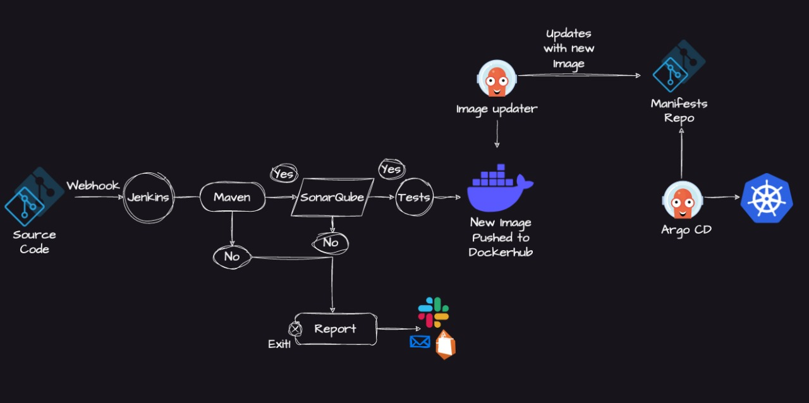

# TEAM #273 - Full DevOps Final Project – README.md

## 🚀 Overview

This project is a **complete DevOps Full-Stack Deployment Pipeline** built from scratch, covering everything from containerization to CI/CD, Kubernetes, GitOps, monitoring, artifact management, and deployments on AWS EKS.


It demonstrates real-world DevOps practices and production-grade architecture using:


* **Docker & lightweight multi-stage builds**
* **Docker Compose stack** (local full-stack environment)
* **Kubernetes + Kustomize** with Namespaces, Deployments, StatefulSets, Services, PVCs
* **ArgoCD GitOps workflow** for automated continuous deployment
* **Monitoring stack (Prometheus + Grafana)**
* **SonarQube + PostgreSQL** for code quality
* **Nexus Repository Manager** for artifact & Docker registry hosting
* **CI pipelines** via GitHub Actions + Jenkins
* **AWS EKS cluster** deployed with Terraform

This project reflects an end-to-end DevOps lifecycle designed professionally.

---

# 🐳 1. Docker & Multi-Stage Image

A highly optimized **multi-stage Dockerfile** was created using `maven:3.9.11-eclipse-temurin-17-alpine` for building and `eclipse-temurin:17-jre-alpine` for runtime.

### Key features:

* **Multi-stage build** → smallest possible final image
* **Dependency caching** using `--mount=type=cache` for Maven
* **Non-root app user** for security
* **Lightweight JRE Alpine base image**
* **Proper ENTRYPOINT** for running Spring Boot

This ensures a fast, secure, and minimal production image.

---

# 🧩 2. Docker Compose – Full Local Stack

The project includes a complete multi-service environment:

* **Spring Boot Application**
* **MySQL Database** with health checks and persistent storage
* **Prometheus** for metrics scraping
* **Grafana** for dashboards
* **SonarQube + PostgreSQL Database**
* **Nexus Repository Manager** (port 8083 for Docker registry)

This environment makes it easy to run the full system locally for development and testing.

---

# ☸️ 3. Kubernetes (K8s) – Complete Production-Level Setup

Kubernetes is fully organized using **Kustomize** with the following directory structure:


```
k8s
├── argocd
├── db
├── monitoring
├── namespaces
└── twitter-app
```

Each module is separated for clarity, reusability, and GitOps compatibility.

## ✔ Namespaces

Dedicated namespaces provide resource isolation:

* `db`
* `twitter-app`
* `monitoring`

## ✔ Twitter App Deployment

* 2 replicas (high availability)
* Resource limits + requests for stability
* Environment variables for connecting to MySQL
* ClusterIP service for internal communication

## ✔ MySQL – Converted to StatefulSet

MySQL uses a **StatefulSet** with a headless service:

* predictable pod name: `mysql-0`
* stable storage using `volumeClaimTemplates`
* headless service (`clusterIP: None`) for stable DNS

## ✔ Monitoring Stack

Prometheus + Grafana deployed via Kubernetes:

* Custom datasource configuration
* Prometheus ConfigMap for scraping Spring Boot Actuator metrics
* Grafana dashboards auto-provisioned

### ⚠ Prometheus Issue Solved

Prometheus could not scrape the app due to AWS security groups.
A dedicated inbound rule was added in EKS security groups to allow Prometheus to reach the app metrics endpoint.

---

# 🧰 4. ArgoCD – GitOps Deployments

ArgoCD continuously monitors the Git repository for changes and automatically syncs:

* Twitter App


* Monitoring Stack


Images provided show ArgoCD UI:

* application health
* sync status
* monitoring setup

Any update in manifests automatically deploys to the EKS cluster.


---

# 🛢 5. Nexus Repository Manager


Nexus3 is deployed via Docker Compose as a local artifact repository:

* hosted Docker registry at **port 8083**
* Maven repository support
* Used for storing artifacts and images

The project successfully pushed the built image into Nexus registry.

---

# 🔍 6. CI Pipelines



## CI/CD with GitHub Actions


Automates:

* Maven build
* Docker image build
* Trivy vulnerability scan
* Push to DockerHub
* Auto-update Kubernetes manifests image tag
* Auto-commit back to Git repo → ArgoCD redeploys automatically

This completes a **GitOps continuous deployment pipeline**.

## CI with Jenkins


Stages include:

* Checkout from GitHub
* Build with Maven Wrapper
* SonarQube code analysis
* Docker image build
* Image push to DockerHub

The Jenkins UI images show runs and logs.

---

# ☁️ 7. AWS EKS Cluster via Terraform

The EKS module includes:

* A VPC
* Public & private subnets
* Internet gateway
* EKS cluster + node groups
* IAM roles and policies

Terraform files:

```
main.tf
variables.tf
outputs.tf
deployment-service.yaml
```

Prometheus, Grafana, ArgoCD, app, and DB were successfully deployed on EKS.

Images include:


---

# 📊 8. Monitoring Stack (Prometheus + Grafana)

### Prometheus


Collects metrics from:

* Spring Boot app via `/actuator/prometheus`
* Node-exporter (optional)

### Grafana


Loaded with dashboards showing:

* JVM memory
* CPU / RAM
* HTTP Requests
* Database connections

### Issues Fixed

* Prometheus was blocked by the app security group in AWS
* Fixed by updating SG inbound rules

---

# 🧪 9. SonarQube – Code Quality

SonarQube + PostgreSQL provide:


* Code scanning
* Quality gates
* Duplications, bugs, code smells scan

Integrated with Jenkins pipeline.

---

# 📸 10. Project Images Directory

```
images
├── eks-argocd-fullstack.jpg
├── eks-argocd.jpg
├── flow.png
├── k8s-argo.PNG
├── k8s-argocd-monitoring.PNG
├── k8s-argocd-twitter-app.PNG
├── project-actions.PNG
├── project-app.PNG
├── project-grafana.PNG
├── project-jenkins.PNG
├── project-nexus.PNG
├── project-prometheus.PNG
└── project-sonar.PNG
```

These images include:

* Full architecture flow
* EKS cluster overview
* ArgoCD dashboards
* Monitoring dashboards
* CI pipeline UIs
* Nexus registry

---

# 🧱 11. Project Architecture Summary

The architecture consists of:

* **CI Layer:** Jenkins + GitHub Actions
* **Artifact Layer:** Nexus Repository
* **Image Layer:** DockerHub / Nexus
* **Deployment Layer:** ArgoCD + Kubernetes + EKS
* **Monitoring Layer:** Prometheus + Grafana
* **Database Layer:** MySQL StatefulSet + PVC

Each piece is fully integrated.

---

# 🟩 12. Final Notes

This repository demonstrates real-world cloud-native DevOps practices including:

* GitOps automation
* Infrastructure as Code (Terraform)
* CI/CD integration
* Secure containerization
* Monitoring and observability
* Artifact management
* Cloud cluster orchestration

Everything is fully automated and production-ready.

---

# 🙌 Authors
**TEAM 273 :**

**Rabia Adel** – DevOps Engineer

**Mazen Hassan** – DevOps Engineer

**Abdelrahman Mohamed Anter** – DevOps Engineer

**Mahmoud Hussien** – DevOps Engineer

**Ziad Wageeh** – DevOps Engineer

**Mohamed Ghoniem** – DevOps Engineer
